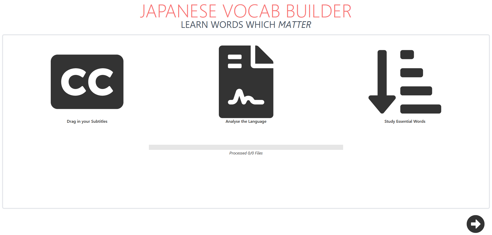
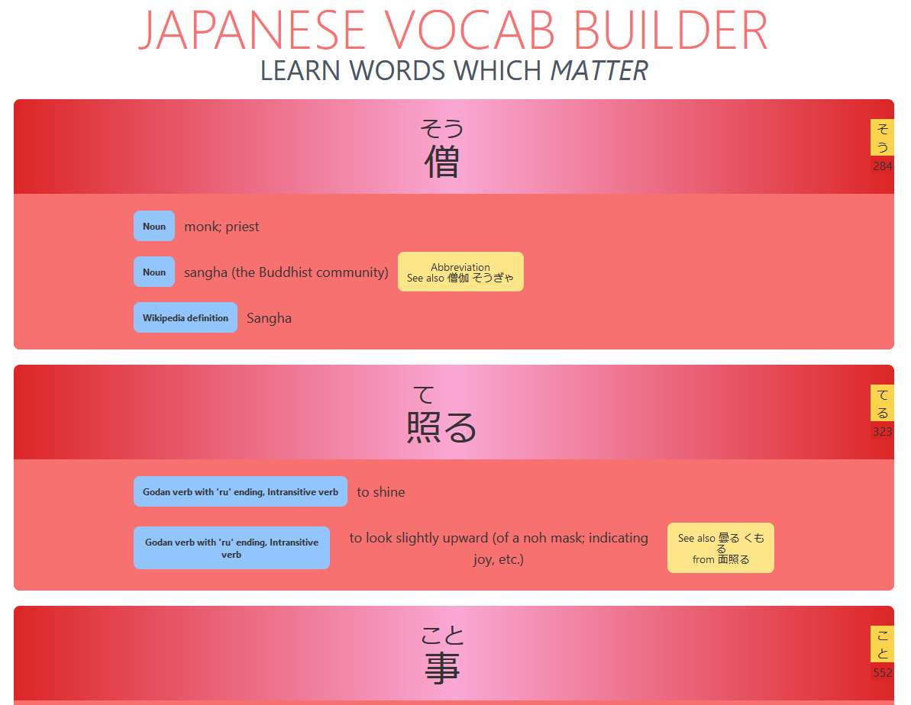

# JPVocabBuilder
Prepare yourself for the latest Japanese shows by studying personalised vocab

## How to Use
Open the website and either click the upload button or drag and drop your subtitle files (from your computer) onto the page.
Once the progress bar indicates that all the files have been processed, click the next buton down below and view the top 1000 most frequent (unordered) words.

## Technical Details
This project was built using Rust for processing the subtitle files.
By using Rust WASM (Web Assembly), we can process subtitles extremely fast and efficients on the browser itself (no uploads required)!
Processing subtitles works by first filtering through each text document for Japanese characters (based on their unicode values) and then using the [Tiny Segmenter](http://chasen.org/~taku/software/TinySegmenter/) algorithm for breaking down raw text into its component words. After this any single-symbol hiragana or katakana (Japanese phonetic lettering systems) characters such as particles (like wa/わ or ga/が, only have grammatical function) are filtered out.

The definitions, readings (pronounciation), example sentences and more are found through querying [Jisho](https://jisho.org/) (online dictionary).

The front end was built using [Svelte](https://svelte.dev/) (front-end framework) and [Tailwind](https://tailwindcss.com/) (CSS framework).
